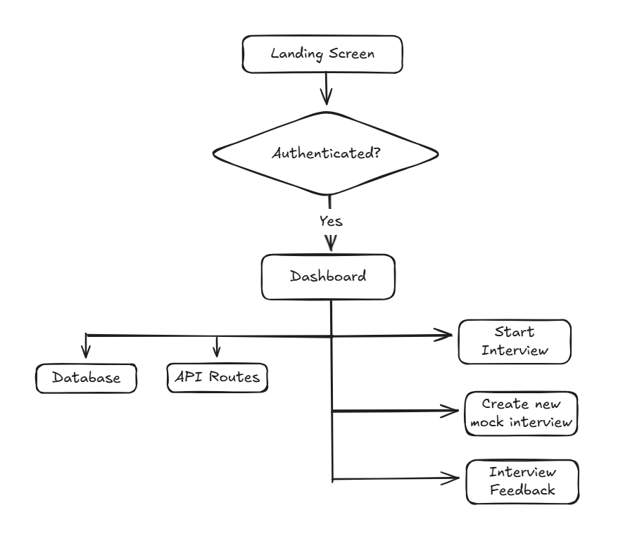

# 01. Architecture Overview: MockMate

## 1. High-Level Architecture

MockMate is built as a modern, serverless-first application designed for speed, scalability, and ease of maintenance. The architecture is split between a **Next.js Frontend/API Layer** and specialized third-party services for AI, Data, Authentication, and Rate Limiting.

| Component Layer | Technology Stack | Primary Function |
| :--- | :--- | :--- |
| **Frontend & API Gateway** | Next.js (React, TypeScript), Tailwind CSS, shadcn/ui | User Interface, Frontend Logic, API Routing. |
| **Data Persistence & Functions** | Convex (Real-time Database & Backend Functions) | Stores all user data, interview records, questions, and final feedback. |
| **Authentication & Billing** | Clerk (Auth), Clerk Billing (Stripe Integration) | Handles user sign-up/sign-in, sessions, and paid subscription logic (Pro Plan). |
| **AI Workflow (Generative AI)** | **n8n** (Automation Workflow Tool) | Executes multi-step AI logic for question generation and feedback. |
| **Security & Rate Limiting** | **ArcJet** | Enforces rate limits (2 free interviews/day) for non-subscribed users. |
| **File Storage** | **ImageKit** | Cloud storage solution for secure PDF Resume uploads. |

## 2. System Workflow Diagram

*(**Note:** This section requires you to generate and insert a visualization into `/docs/diagrams/system_workflow.png`)*

The system workflow initiates from the user interface, routing critical tasks through the Next.js API layer to specialized external services.

## 3. Component Breakdown

### A. Frontend and Client
* **Framework:** Next.js with the App Router (React Server Components where possible for performance).
* **Styling:** Tailwind CSS for utility-first styling, complemented by `shadcn/ui` components for a modern, responsive interface.
* **Routing:** Folder-based routing handles core views: `/dashboard`, `/interview/[id]`, `/interview/[id]/feedback`.

### B. Core Backend/Database (Convex)
* **Database:** Convex provides a real-time, schematized data layer. This choice simplifies reactive UI updates and handles complex data relationships (e.g., linking `users` to `interviewSession` records).
* **Backend Functions:** Convex is used for secure server-side mutations (`saveInterviewQuestions`, `updateFeedback`) and queries (`getInterviewList`) to manage persistent data.

### C. AI and Application Logic Flow
The core logic for interview creation and analysis is abstracted out to dedicated, scalable services:

1.  **Question Generation API (`/api/generate-interview-questions`)**
    * Receives user input (Resume PDF or Job Description text).
    * Handles **ArcJet** rate limiting to check daily free credit usage.
    * If a resume is uploaded, it uploads the file to **ImageKit** and passes the secure URL to the **n8n** workflow.
    * Triggers a specialized **n8n** webhook that executes a multi-step workflow for data extraction (PDF to text) and LLM prompting.

2.  **Feedback Generation API (`/api/generate-feedback`)**
    * Receives the complete conversation transcript (`messages` array) from the Akool-powered interview session.
    * Triggers a second **n8n** webhook designed for rapid AI analysis (LLM prompting). The LLM is instructed to generate structured JSON output containing `feedback`, `suggestion`, and `rating`.

### D. Interview Simulation Layer (TTS & Question Pacing)
* The interview session (`/interview/[id]/start`) fetches the generated questions from Convex.
* The application sequentially displays each question and utilizes a standard Text-to-Speech library to read the question aloud, providing auditory realism for the prototype. The user's typed/recorded answer is then captured to form the conversation transcript.