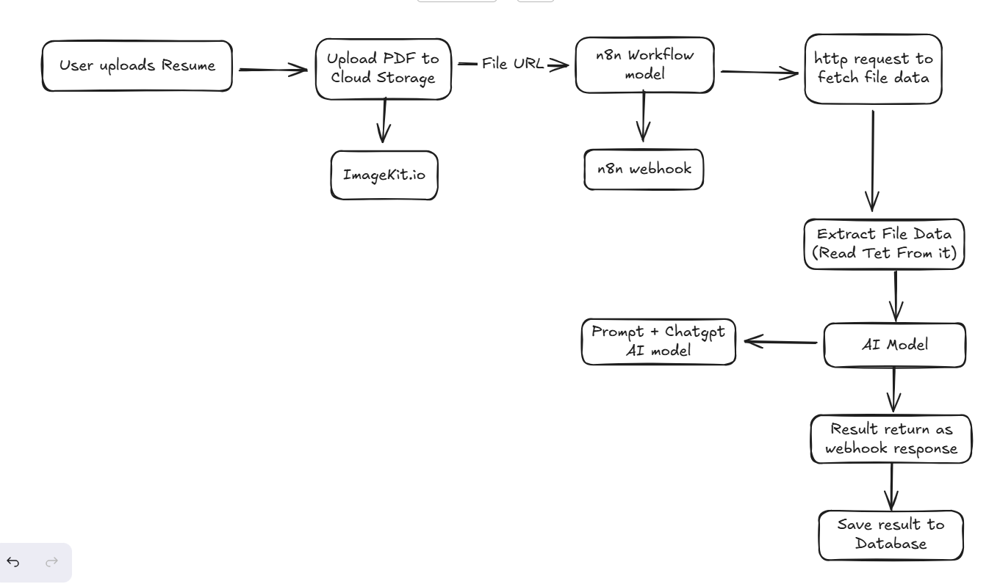

# 02. Data Model and Flow

## 1. Core Data Model (Convex Schema)

The database schema is defined in `convex/schema.ts` and uses Convex's powerful relationship modeling and data types.

| Table Name | Key Fields | Type / Relationship | Purpose |
| :--- | :--- | :--- | :--- |
| **users** | `name`, `email`, `imageUrl` | `string` | Stores basic user profile information after Clerk authentication (synced in `app/Provider.tsx`). |
| **interviewSession** | `_id` | `Id<'interviewSession'>` | Primary record ID for each created interview. |
| | `userId` | `Id<'users'>` (Relationship to `users`) | Links the interview record to the creator. |
| | `status` | `string` (e.g., 'Draft', 'Completed') | Tracks the interview's lifecycle. |
| | `resumeUrl` | `string | null` | URL of the uploaded resume (via ImageKit) if applicable. |
| | `jobTitle`, `jobDescription` | `string | null` | Textual job details if the user chose this input method. |
| | `interviewQuestions` | `any[]` (Array of Q&A objects) | The list of generated questions and correct answers from the AI. |
| | `feedback` | `any | null` | Structured JSON object from AI containing `rating`, `feedback`, and `suggestion` after completion. |

## 2. Key API Endpoints

The core business logic is exposed through Next.js API routes (`/app/api/`) and Convex backend functions.

| Functionality | Endpoint / Location | Method | Description |
| :--- | :--- | :--- | :--- |
| **Auth Check/Sync** | `convex/users.ts` (`createNewUser`) | MUTATION | Saves/Updates user data on login if not already present. |
| **Rate Limiting** | `app/api/arcjet/route.ts` | GET/POST | Core logic for defining and protecting routes with usage limits. |
| **Generate Questions** | `app/api/generate-interview-questions/route.tsx` | POST | Triggers the n8n AI workflow for question generation based on user input (Job Description or Resume). |
| **Generate Feedback** | `app/api/generate-feedback/route.ts` | POST | Sends the complete conversation transcript (captured during the TTS simulation) to the n8n AI workflow for scoring and feedback generation. |
| **Save Interview Record** | `convex/Interview.ts` (`saveInterviewQuestions`) | MUTATION | Inserts the new interview questions and metadata into the database. |
| **Update Final Feedback** | `convex/Interview.ts` (`updateFeedback`) | MUTATION | Patches the `interviewSession` record with the AI-generated feedback JSON. |

## 3. Data Flow: Interview Creation (Resume Upload Path)

The following diagram illustrates the secure, asynchronous data flow for converting a user-uploaded resume into the final structured interview questions stored in the database.

1.  **User Action:** User uploads a PDF resume in `CreateInterviewDialog.tsx`.
2.  **Request:** Frontend calls `POST /api/generate-interview-questions` with the PDF file (as `FormData`).
3.  **API Logic:**
    * The route checks user subscription status (Clerk) and remaining daily credits (ArcJet).
    * File is uploaded to **ImageKit**, returning a public URL.
    * The API triggers the **n8n Question Generator Webhook** with the ImageKit URL.
4.  **n8n Workflow (AI Logic):**
    * n8n downloads the PDF from ImageKit URL.
    * n8n uses a PDF parser node to extract raw text content.
    * n8n sends the extracted text, along with a System Prompt, to the LLM (e.g., Gemini/GPT) to generate a structured JSON array of Q&A pairs.
5.  **Response Handling:**
    * n8n returns the structured JSON to the Next.js API.
    * API calls the Convex mutation `saveInterviewQuestions` to store the data and interview metadata.
    * Frontend receives the new interview ID and navigates the user to `/interview/[ID]`.