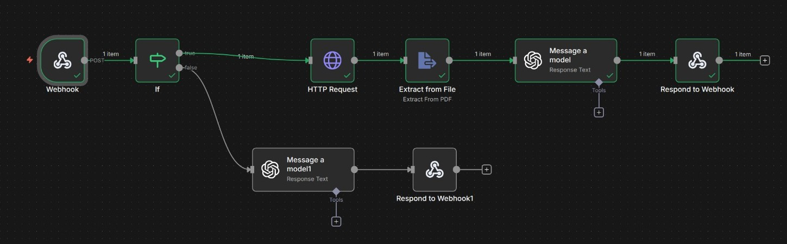
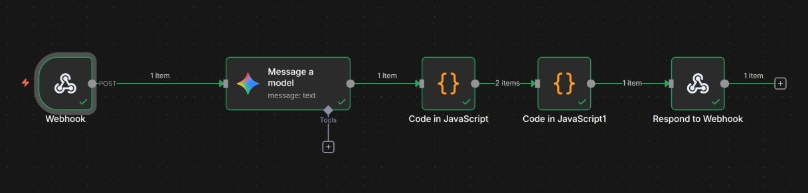

# 03. AI Model Integration & Workflow Design

The core of MockMate is its multi-tiered AI integration, utilizing external workflow tools (n8n) to abstract complexity and ensure scalability.

## 1. Core AI Logic: Workflow Automation (n8n)

We employ two dedicated **n8n** workflows, triggered via webhooks from the Next.js API, to handle the most computationally expensive and multi-step processes.

### A. AI Question Generation Workflow

* **Trigger:** Next.js API route `POST /api/generate-interview-questions`.
* **Input:** Resume PDF URL (ImageKit) OR Job Title/Description Text.
* **Flow Visualization:**
  
* **Prompting Strategy (Two Paths):**
    1.  **Resume Path:** `Resume URL` -> **HTTP Request Node** (Download PDF) -> **PDF Parser Node** (Extract Text) -> **LLM (Chat)**.
    2.  **JD Path:** `JD Text` -> **LLM (Chat)**.
* **LLM System Prompt Example:**
    > "You are a specialized interview question generator. Based on the provided candidate resume or job description, your goal is to generate 10 highly relevant and challenging interview questions. The output MUST be a strict JSON object with a key 'questions', which is an array of objects, each containing 'question' and 'suggested_answer' keys."
* **Output:** Structured JSON containing the 10 Q&A pairs, which is then saved to the Convex database.

### B. AI Interview Feedback Generation Workflow

* **Trigger:** Next.js API route `POST /api/generate-feedback`.
* **Input:** The complete, unedited conversation transcript (captured from user input) to be analyzed.
* **Flow Visualization:**
  
* **LLM System Prompt Example:**
    > "You are a performance analysis expert. Analyze the following interview transcript between a candidate and an interviewer. Provide a detailed report. Your final output MUST be a strict JSON object with three keys: 'rating' (float out of 10), 'feedback' (detailed summary of strengths and weaknesses), and 'suggestion' (list of 3 actionable improvement areas)."
* **Output:** Structured JSON (`feedback`, `suggestion`, `rating`) used to update the `interviewSession` record in Convex.

## 2. Interview Simulation: Prototype Implementation (TTS)

For the Round 2 functional prototype, the live interview is simulated using readily available client-side technologies.

* **Simulation Logic:** When the user starts the interview, the system initiates a paced session:
    1.  The next question is fetched from the Convex database.
    2.  The question text is displayed on the screen.
    3.  A **Text-to-Speech (TTS)** feature reads the question aloud to simulate the "voice" of the interviewer.
    4.  The user's response is captured via microphone/text input and added to the conversation transcript, which is stored locally until the interview concludes.
* **Goal:** This setup achieves the requirement of showcasing the core AI logic (Q&A generation and feedback processing) while providing a realistic auditory experience to be completed with a full streaming solution in the next round.

## 3. Technology Justification

| Feature | Technology | Rationale |
| :--- | :--- | :--- |
| **Workflow Complexity** | **n8n** | Writing PDF parsing, API chaining, and multi-LLM prompts within a single Next.js API route is complex. n8n abstracts this into visual, scalable, and independently deployable workflows, allowing the Next.js app to remain lean. |
| **Rate Limiting** | **ArcJet** | Offers a developer-centric, declarative way to enforce the free-tier usage policy (`2 daily interviews`) without complex, custom database logic. |